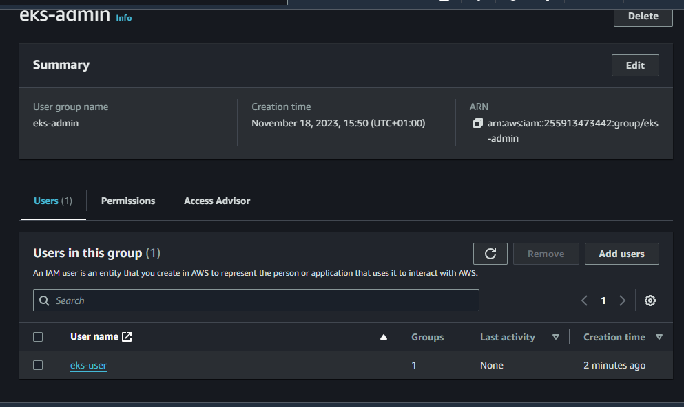
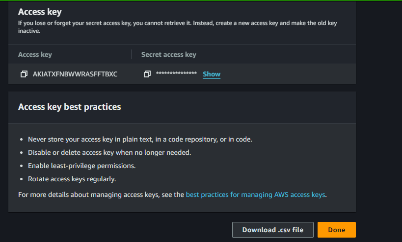

# Terraform eks modules version 19.20.0

This repo contains version 19.20.0 of eks modules and its necessary resources

## Create AWS VPC using Terraform

First of all, we need to define aws terraform provider. You have multiple ways to authenticate with AWS. It will depend on how and where you run terraform. For example, if you use your laptop to create an EKS cluster, you can simply create a local AWS profile with the aws configure command. If you run terraform from an EC2 instance, you should create an instance profile with the required IAM policies.

To create AWS VPC, we use terraform-aws-module and the latest version at this moment. Let's call it main and provide a CIDR range. For EKS, you need at least two availability zones. Let's use us-east-2a and 1b. Almost in all cases, you want to deploy your Kubernetes workers in the private subnets with a default route to NAT Gateway. However, if you're going to expose your application to the internet, you would need public subnets with a default route to the Internet Gateway.

Now you have multiple options for how you want to deploy the NAT gateway. You can deploy one single NAT Gateway in one availability zone or choose to create a highly available setup and deploy one NAT Gateway per zone. It depends on your budget and requirements. I always prefer to create a single NAT gateway and allocate multiple Elastic IP addresses.

## Create EKS using Terraform

Now we have all the components that we need to create an EKS cluster. Specify the latest supported version by AWS. Right now, it's 1.27. If you have a bastion host or a VPN, you can enable a private endpoint and use it to access your cluster. Since we just created VPC, I don't have either one. I would need to enable a public endpoint as well to access it from my laptop.

Next is a VPC ID that you can dynamically pull from the VPC module. You must also provide subnets to your cluster where EKS will deploy workers. Let's use only private subnets. To grant access to your applications running in the EKS cluster, you can either attach the IAM role with required IAM policies to the nodes or use a more secure option which is to enable IAM Roles for Service Accounts. In that way, you can limit the IAM role to a single pod. Then the node's configuration. For example, you can specify the disk size for each worker.

To run the workload on your Kubernetes cluster, you need to provision instance groups. You have three options.

- You can use EKS-managed nodes; that is recommended approach. In that way, EKS can perform rolling upgrades for you almost without downtime if you properly define PodDisruptionBudget policies.
- Then you can use self-managed groups. Basically, terraform will create a launch template with an auto-scaling group as your node pool and join the cluster. Using this approach, you would need to maintain your nodes yourself.
- Finally, you can use the Fargate profile. This option allows you to only work on your workload, and EKS will manage nodes for you. It will create a dedicated node for each of your pods. It can potentially save you money if Kubernetes is badly mismanaged.

Let's create managed node groups for this example.

## Add IAM User & Role to EKS

Next, I want to show you how to grant access to Kubernetes workloads to other IAM users and IAM roles. Access to the EKS is managed by using the aws-auth config map in the kube-system namespace. Initially, only the user that created a cluster can access Kubernetes and modify that configmap. Unless you provisioned EKS for your personal project, you most likely need to grant access to Kubernetes to your team members.

Terraform module that we used to create an EKS can manage permissions on your behalf. You have two options.

- You can add IAM users directly to the eks configmap. In that case, whenever you need to add someone to the cluster, you need to update the aws-auth configmap, which is not very convenient. That is the first one we will create with the terraform script.

Also, you need to authorize terraform to access Kubernetes API and modify aws-auth configmap. To do that, you need to define terraform kubernetes provider. To authenticate with the cluster, you can use either use token which has an expiration time or an exec block to retrieve this token on each terraform run.

```
# https://github.com/terraform-aws-modules/terraform-aws-eks/issues/2009
data "aws_eks_cluster" "default" {
  name = module.eks.cluster_id
}

data "aws_eks_cluster_auth" "default" {
  name = module.eks.cluster_id
}

provider "kubernetes" {
  host                   = data.aws_eks_cluster.default.endpoint
  cluster_ca_certificate = base64decode(data.aws_eks_cluster.default.certificate_authority[0].data)
  # token                  = data.aws_eks_cluster_auth.default.token

  exec {
    api_version = "client.authentication.k8s.io/v1beta1"
    args        = ["eks", "get-token", "--cluster-name", data.aws_eks_cluster.default.id]
    command     = "aws"
  }
}
```

That's all for now; let's go to the terminal and run terraform. Initialize first and then apply.
```
terraform init
terraform apply
```

Before you can connect to the cluster, you need to update the Kubernetes context and check whether you can connect with the following command:
```
aws eks update-kubeconfig --name onyeka-eks-version-19-20-0 --region us-east-2
kubectl get nodes
```

## Granting access to the IAM role

- The second, much better approach is to grant access to the IAM role just once using the aws-auth configmap, and then you can simply allow users outside of EKS to assume that role. Since IAM groups are not supported in EKS, this is the preferred option.

Now, we create an IAM role with the necessary permissions and allow the IAM user to assume that role.

Create another file  **allow-eks-acess.tf**

First, let's create an allow-eks-access IAM policy with eks:DescribeCluster action. This action is needed to initially update the Kubernetes context and get access to the cluster.

Next is the IAM role that we will use to access the cluster. Let's call it eks-admin since we're going to bind it with the Kubernetes system:masters RBAC group with full access to the Kubernetes API. Optionally this module allows you to enable two-factor authentication, but it's out of the scope of this work.

Then attach the IAM policy that we just created and, most importantly, define trusted role arns. By specifying the root potentially, every IAM user in your account could use this role. To allow the user to assume this role, we still need to attach an additional policy to the user.

The IAM role is ready, now let's create a test IAM user that gets access to that role. Let's call it eks-user and disable creating access keys and login profiles. We will generate those from the UI.

Then IAM policy to allow assume eks-admin IAM role.

Finally, we need to create an IAM group with the previous policy and put our eks-user in this group.

Let's go ahead and apply terraform to create all those IAM entities.
```
terraform init
terraform apply
```

## Now let's go to the aws consule and generate new credentials for eks-user and create a local AWS profile.





To create an AWS profile, you need to run aws configure and provide the profile name, in our case, user - eks-user.
```
aws configure --profile eks-user
```

Then verify that you can access AWS services with that profile.

```
aws sts get-caller-identity --profile eks-user

{
    "UserId": "AIDATXFNBWWRP22YQNZH5",
    "Account": "255913473442",
    "Arn": "arn:aws:iam::255913473442:user/eks-user"
}

```

To let **eks-user** to assume the eks-admin IAM role, we need to create another AWS profile with the role name. You need to replace role_arn bearing your account number with yours.
```
vim ~/.aws/config
```

```
~/.aws/config

[profile eks-admin]
role_arn = arn:aws:iam::255913473442:role/eks-admin
source_profile = eks-user
```

Let's test if we can assume the eks-admin IAM role.
```
aws sts get-caller-identity --profile eks-admin

{
    "UserId": "AROATXFNBWWRAX3BVM252:botocore-session-1700320281",
    "Account": "255913473442",
    "Arn": "arn:aws:sts::255913473442:assumed-role/eks-admin/botocore-session-1700320281"
}
```

Now we can update Kubernetes config to use the eks-admin IAM role. You need to replace cluster name and region with yours.
```
aws eks update-kubeconfig \
  --name my-eks \
  --region us-east-1 \
  --profile eks-admin

aws eks update-kubeconfig --name onyeka-eks-version-19-20-0 --region us-east-2 --profile eks-admin
```

If you try to access EKS right now, you'll get an error saying You must be logged in to the server (Unauthorized).
```
kubectl auth can-i "*" "*"
```

To add the eks-admin IAM role to the EKS cluster, we need to update the aws-auth configmap. Tweak the main.tf like below

```
  manage_aws_auth_configmap = true
  aws_auth_roles = [
    {
      rolearn  = module.eks_admins_iam_role.iam_role_arn
      username = module.eks_admins_iam_role.iam_role_name
      groups   = ["system:masters"]
    },
  ]
```

Now you can run terraform.

```
terraform apply
```

Let's check if we can access the cluster using the eks-admin role.
```
kubectl auth can-i "*" "*"
```

Since we mapped the eks-admin role with the Kubernetes system:masters RBAC group, we have full access to the Kubernetes API.

Suppose you want to grant read-only access to the cluster, for example, for your developers. You can create a custom Kubernetes RBAC group and map it to the IAM role.

## Reference

- https://registry.terraform.io/modules/terraform-aws-modules/iam/aws/latest

- https://antonputra.com/amazon/create-eks-cluster-using-terraform-modules/#add-iam-user-role-to-eks
